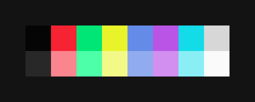

# DarknessX-vim


A dark neovim color scheme
based on - snazzy (Based on [hyper-snazzy](https://github.com/sindresorhus/hyper-snazzy/) by [Sindre Sorhus](https://sindresorhus.com))

### Credit

The generate script comes from this repo: https://github.com/ChristianChiarulli/nvcode-color-schemes.vim
and https://github.com/felipec/vim-felipec

### Requirements 

This color scheme requires [treesitter](https://github.com/nvim-treesitter/nvim-treesitter) and [Neovim](https://neovim.io/) > 0.5.

## Installing

With `Packer`

```lua
use 'UltimateOmega/DarknessX-vim'
use 'nvim-treesitter/nvim-treesitter'
```

## Configuring

Add this to your `init.lua` file 
```lua
vim.cmd('colorscheme darknessX')
```
##### Lualine

To enable the [lualine](https://github.com/hoob3rt/lualine.nvim) theme:

```lua
require('lualine').setup {
  options = {
    theme = 'darknessX'
  }
}
```
